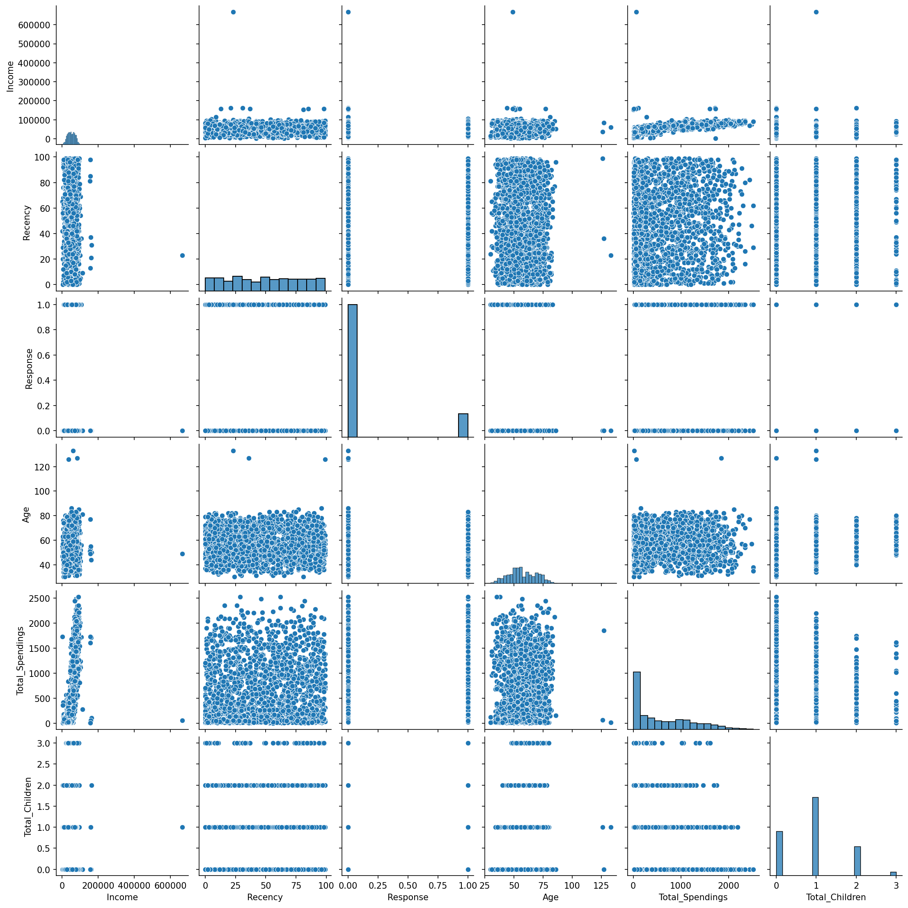
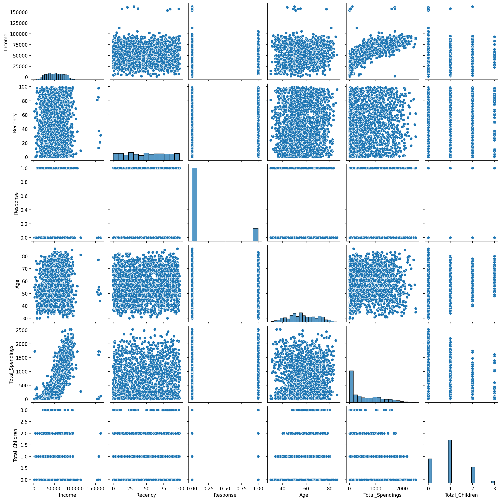
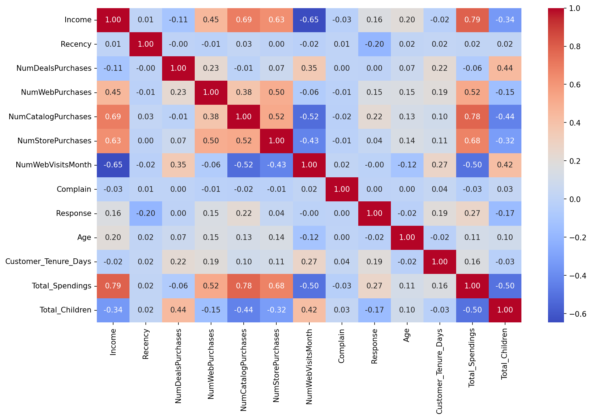
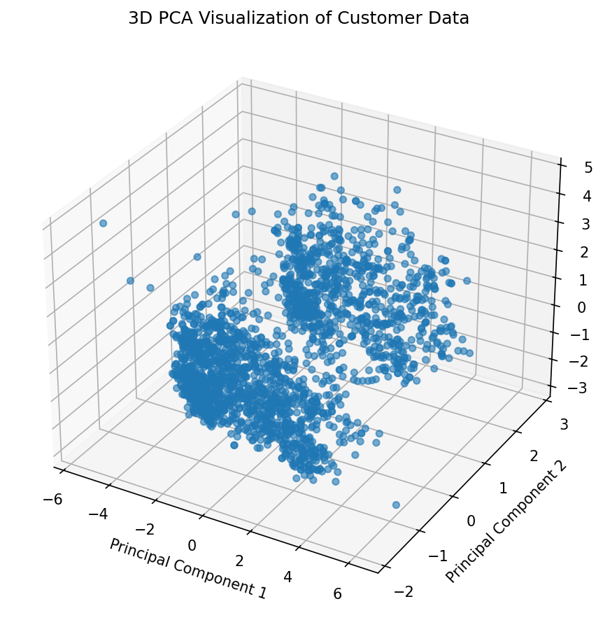
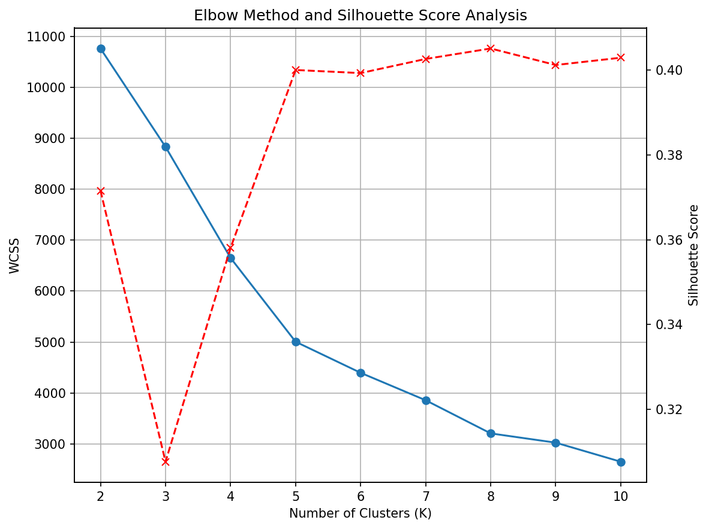
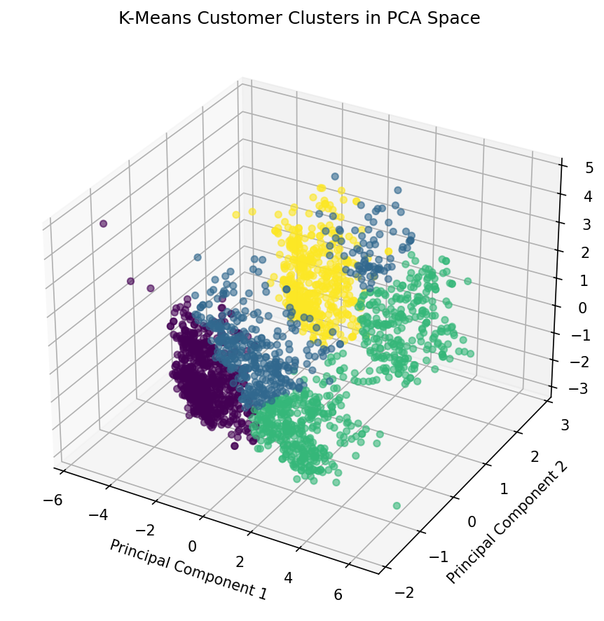
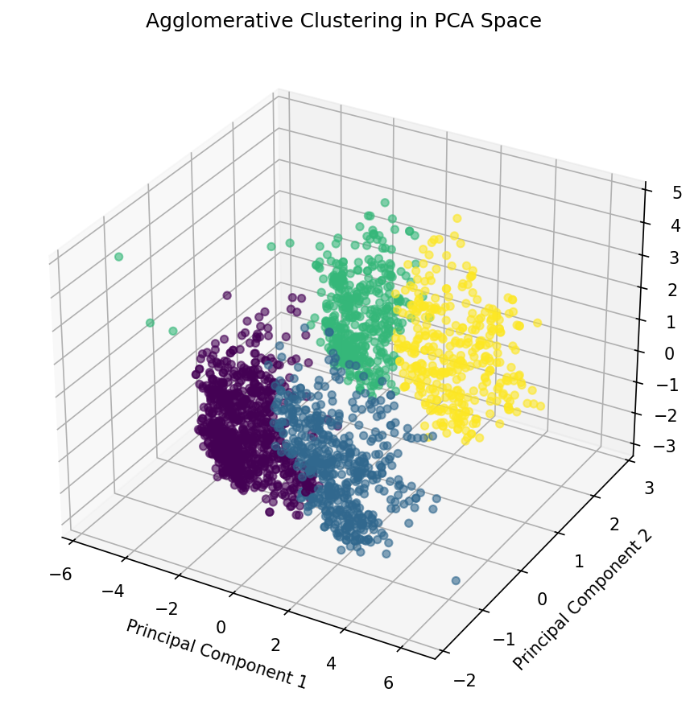
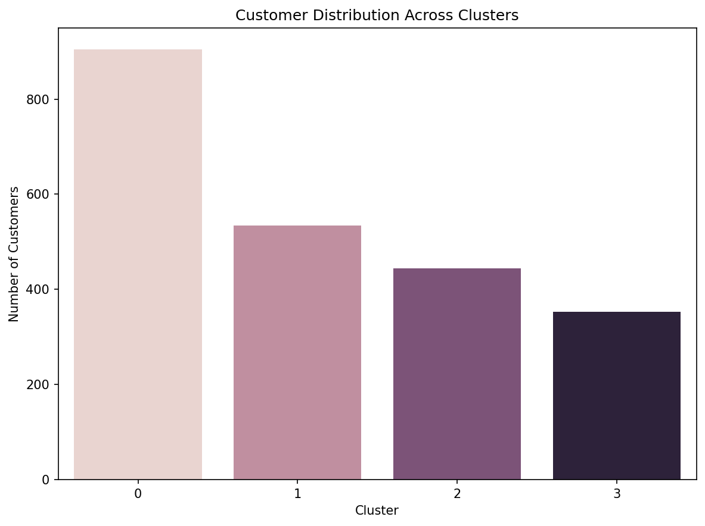
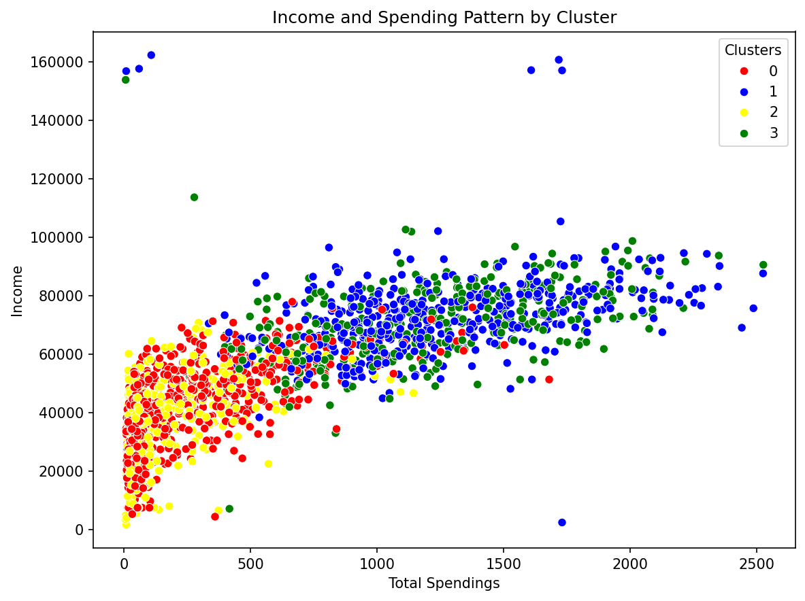

# SmartCart Clustering System — Analysis Report

*Companion document to [README.md](README.md). This report walks through
every analytical step performed in `notebooks/01_data_preprocessing.ipynb`,
with the actual numbers, correlation values, and figures produced by the
executed notebook.*

---

## 1. Executive Summary

The SmartCart project segments 2,240 retail customers into behavioral
groups using unsupervised learning. After cleaning, feature engineering,
and outlier removal, 2,236 customers and 18 standardized features were
reduced to 3 principal components (explaining **~45%** of total
variance) and clustered with **K-Means** and **Agglomerative Clustering**
using **K = 4**, chosen via the Kneedle elbow method.

The four resulting segments differ mainly along two axes — **income
level** and **household composition (partnered vs. living alone)** —
and show clear, business-relevant differences in spending, purchase
channel, and marketing responsiveness:

- **Cluster 0** — partnered, more children, low/moderate income and
  spend, weak campaign response.
- **Cluster 1** — partnered, high income, high spend, heavy multi-channel
  buyers.
- **Cluster 2** — living alone, most children, lowest income and spend,
  highest complaint rate.
- **Cluster 3** — living alone, high income and spend, by far the
  **best campaign responders** and longest-tenured customers.

The report also flags two methodological issues worth resolving before
this pipeline is finalized: clustering is currently performed on the
**PCA-reduced data rather than the full scaled feature set**, and the
**Silhouette Score analysis suggests K=4 is not the best-separated
option** in the tested range (see §9–§10).

---

## 2. Dataset Description

- **Source file:** `data/raw/smartcart_customers.csv`
- **Raw shape:** 2,240 rows × 22 columns
- **Missing values:** only `Income` has missing values — **24 rows**
  (~1.1% of records)

| Group | Columns |
|---|---|
| Demographics | `ID`, `Year_Birth`, `Education`, `Marital_Status`, `Income`, `Kidhome`, `Teenhome`, `Dt_Customer` |
| Spending | `MntWines`, `MntFruits`, `MntMeatProducts`, `MntFishProducts`, `MntSweetProducts`, `MntGoldProds` |
| Purchase behavior | `NumDealsPurchases`, `NumWebPurchases`, `NumCatalogPurchases`, `NumStorePurchases`, `NumWebVisitsMonth` |
| Other | `Recency`, `Complain`, `Response` |

`Response` (campaign acceptance flag) is present in the raw data and is
carried through the whole pipeline — it is not used as a clustering
feature, but it turns out to be one of the most differentiating
variables during cluster profiling (§13).

---

## 3. Missing Value Handling

`Income` is imputed with the **median**:

```python
df["Income"] = df["Income"].fillna(df["Income"].median())
```

Median imputation is a sensible choice here because income
distributions are right-skewed and contain extreme values that would
distort a mean-based imputation. After imputation, `df.isna().sum()`
confirms zero missing values across all columns.

---

## 4. Feature Engineering

| Feature | Formula | Notes |
|---|---|---|
| `Age` | `datetime.now().year - Year_Birth` | Computed dynamically from the system clock at run time (evaluated to 2026 in the saved run). This means **`Age` — and everything downstream of it — will silently shift by 1 every year the notebook is re-run**, which affects reproducibility. Consider anchoring to a fixed reference year instead. |
| `Customer_Tenure_Days` | `max(Dt_Customer) - Dt_Customer`, in days | Tenure is relative to the *most recent enrollment date in the dataset*, not today's date — this is a reasonable choice for a static snapshot dataset. |
| `Total_Spendings` | `MntWines + MntFruits + MntMeatProducts + MntFishProducts + MntSweetProducts + MntGoldProds` | Aggregates all product-category spend into one variable. |
| `Total_Children` | `Kidhome + Teenhome` | Household size proxy. |

**Education regrouping** (`Education` → 3 categories):

| Original | Regrouped | Count |
|---|---|---|
| `Basic`, `2n Cycle` | `Undergraduate` | 257 |
| `Graduation` | `Graduate` | 1,127 |
| `Master`, `PhD` | `Postgraduate` | 856 |

**Marital status regrouping** (`Marital_Status` → `Living_With`):

| Original | Regrouped | Count |
|---|---|---|
| `Married`, `Together` | `Partner` | 1,444 |
| `Single`, `Divorced`, `Widow`, `Absurd`, `YOLO` | `Alone` | 796 |

Both regroupings collapse noisy, high-cardinality categorical fields
(some values like `Absurd` and `YOLO` are clearly data-entry artifacts)
into clean binary-ish groupings suitable for one-hot encoding.

---

## 5. Feature Removal

After the engineered features above are created, the following columns
are dropped because they are either identifiers, already represented by
an engineered feature, or superseded by an aggregate:

```python
cols = ["ID", "Year_Birth", "Marital_Status", "Kidhome", "Teenhome", "Dt_Customer"]
spending_cols = ["MntWines", "MntFruits", "MntMeatProducts", "MntFishProducts", "MntSweetProducts", "MntGoldProds"]
processed_df = df.drop(columns=cols + spending_cols)
```

| Stage | Shape |
|---|---|
| Original `df` (after feature engineering, before column removal) | (2240, 27) |
| `processed_df` (after column removal) | (2240, 15) |

**Note:** dropping the individual `Mnt*` columns in favor of only
`Total_Spendings` means the model loses information about *spending
mix* (e.g., a wine-heavy buyer vs. a meat-heavy buyer) — this is a
deliberate simplification worth revisiting if category-level marketing
actions are a goal.

---

## 6. Outlier Handling

Extreme values were first inspected visually with a pair plot across
`Income`, `Recency`, `Response`, `Age`, `Total_Spendings`, and
`Total_Children`:

**Before:**



The plot shows a small number of `Age` values sitting far outside the
rest of the distribution, and a single extreme `Income` value.

**Thresholds applied:**

```python
Age >= 90       # 3 customers
Income >= 600000  # 1 customer
```

```text
data size with outliers:    2240
data size without outliers: 2236
```

**After:**



The relationships between variables are much easier to read once these
4 extreme records are removed — the `Income` and `Age` axes in
particular are no longer dominated by isolated points.

---

## 7. Correlation Analysis



Notable correlations from the actual heatmap:

- **`Income` ↔ `Total_Spendings`: 0.79** — the strongest relationship in
  the dataset; higher-income customers spend substantially more overall.
- **`Income` ↔ `NumCatalogPurchases`: 0.69** and **`Income` ↔
  `NumStorePurchases`: 0.63** — income tracks with catalog and in-store
  buying more than with web buying (`Income` ↔ `NumWebPurchases`: 0.45).
- **`Income` ↔ `NumWebVisitsMonth`: −0.65** — higher-income customers
  visit the website *less* often, even though (per above) they spend
  more. This suggests wealthier customers browse less and convert more
  when they do act — a useful insight for a web-engagement strategy.
- **`Total_Children` ↔ `NumDealsPurchases`: 0.44** — households with
  more children lean more on deals/discounts.
- **`Total_Children` ↔ `Income`: −0.34** and **`Total_Children` ↔
  `Total_Spendings`: −0.50** — larger households in this dataset skew
  toward lower income and lower total spend.
- **`Recency` ↔ `Response`: −0.20** — customers who purchased more
  recently are somewhat more likely to have responded to the last
  campaign.
- **`Complain`** is essentially uncorrelated with every other feature
  (all |r| ≤ 0.04), meaning complaints in this dataset don't track with
  spending or engagement patterns.

No features were removed purely on the basis of correlation — the
analysis was used to understand relationships and sanity-check the
engineered features rather than to drive automatic feature elimination.

---

## 8. Encoding and Scaling

The two categorical features (`Education`, `Living_With`) are one-hot
encoded:

```python
ohe = OneHotEncoder(handle_unknown="ignore")
encoded = ohe.fit_transform(processed_df[cat_cols])
```

This expands 2 categorical columns into 5 binary columns
(`Education_Graduate`, `Education_Postgraduate`,
`Education_Undergraduate`, `Living_With_Alone`, `Living_With_Partner`),
bringing `processed_df` to **(2236, 18)**.

All 18 features are then standardized:

```python
scaler = StandardScaler()
X_scaled = scaler.fit_transform(X)
```

Standardization is essential here because K-Means and Agglomerative
Clustering (Ward linkage) both rely on Euclidean distance, and the raw
features span very different scales (e.g., `Income` in the tens of
thousands vs. `Total_Children` in single digits).

---

## 9. Dimensionality Reduction (PCA)

```python
pca = PCA(n_components=3)
X_pca = pca.fit_transform(X_scaled)
```

**Explained variance ratio:** `[0.2316, 0.1139, 0.1041]` — the three
components together explain **~44.9%** of total variance (PC1 alone
explains 23.2%).

**2D projection:**


An interesting structural feature shows up here that isn't mentioned in
the original project notes: the data splits into **two clear
horizontal bands** along PC2. This almost certainly reflects the
one-hot encoded `Living_With_Alone` / `Living_With_Partner` pair, which
after standardization becomes one of the higher-variance directions in
the feature space. In other words, **household status (alone vs.
partnered), not income or spending, is the single strongest driver of
the top two principal components** — which foreshadows it also being
one of the clearest dividing lines between the final clusters (§13).

**3D projection:**



> ⚠️ **Methodological note:** the README's stated design is "models
> trained on `X_scaled`, PCA used only for visualization." **That is
> not what the executed notebook does.** Every downstream step — the
> WCSS/Elbow loop, the Silhouette Score loop, `KMeans.fit_predict`, and
> `AgglomerativeClustering.fit_predict` — is called on **`X_pca`**
> (3 components, ~45% of variance), not on `X_scaled` (18 features,
> 100% of variance). This is a real design decision with real
> consequences: clustering in 3 PCA dimensions is faster and easier to
> visualize, but it also means **~55% of the standardized feature
> variance plays no role in forming the clusters**. See §14 for the
> recommended fix and how to validate which approach gives more
> meaningful segments.

---

## 10. Selecting the Number of Clusters (K)

### 10.1 Elbow Method

```python
wcss = []
for k in range(1, 11):
    kmeans = KMeans(n_clusters=k, random_state=42)
    kmeans.fit_predict(X_pca)
    wcss.append(kmeans.inertia_)

knee = KneeLocator(range(1, 11), wcss, curve="convex", direction="decreasing")
optimal_k = knee.elbow
# → Best k value is 4
```

### 10.2 Silhouette Score

```python
for k in range(2, 11):
    kmeans = KMeans(n_clusters=k, random_state=42)
    labels = kmeans.fit_predict(X_pca)
    score = silhouette_score(X_pca, labels)
```

### 10.3 Combined view



Reading the actual chart:

| K | WCSS (≈) | Silhouette (≈) |
|---|---|---|
| 2 | 10,760 | **0.371** |
| 3 | 8,820 | 0.311 (lowest) |
| **4** | **6,640** | 0.357 |
| 5 | 4,990 | 0.401 |
| 6 | 4,380 | 0.400 |
| 7 | 3,850 | 0.402 |
| 8 | 3,200 | **0.403 (highest)** |
| 9 | 3,020 | 0.401 |
| 10 | 2,630 | 0.402 |

**K = 4** is the point selected by the Kneedle algorithm on the WCSS
curve, and it is a defensible, interpretable choice — the drop-off in
WCSS clearly slows down after K=4. However, the **Silhouette Score at
K=4 (0.357) is actually lower than at every K from 5 to 10**, and the
global maximum in the tested range is at **K=8 (0.403)**. This is a
genuine trade-off, not a data quality issue:

- **K=4** gives four large, easy-to-communicate, business-friendly
  segments (used throughout the rest of this report).
- **K=8** gives more cleanly separated clusters statistically, at the
  cost of being harder to act on operationally.

This trade-off should be made **explicitly** rather than implicitly —
see §14.

---

## 11. Clustering Algorithms

Both algorithms were run with `K = 4` on `X_pca`:

**K-Means:**

```python
kmeans = KMeans(n_clusters=4, random_state=42)
labels_kmeans = kmeans.fit_predict(X_pca)
```



**Agglomerative Clustering (Ward linkage):**

```python
agg_clf = AgglomerativeClustering(n_clusters=4, linkage="ward")
labels_agg = agg_clf.fit_predict(X_pca)
```



Both algorithms recover visually similar cluster boundaries in PCA
space. **`labels_agg` (Agglomerative Clustering) is the labeling used
for all downstream profiling**, not `labels_kmeans` — worth being
explicit about, since the notebook computes both but only carries one
forward.

---

## 12. Cluster Sizes

```python
processed_df["Clusters"] = labels_agg
```



Approximate customer counts per cluster (read from the chart; exact
values were not printed in the notebook):

| Cluster | Approx. size | Share |
|---|---|---|
| 0 | ~905 | ~40% |
| 1 | ~535 | ~24% |
| 2 | ~445 | ~20% |
| 3 | ~350 | ~16% |

Cluster 0 is notably the largest segment — around 4 in 10 customers —
which matters when prioritizing which segment's strategy to act on
first.

---

## 13. Cluster Profiling & Characterization

Full cluster-wise feature means (`processed_df.groupby("Clusters").mean()`):

| Metric | Cluster 0 | Cluster 1 | Cluster 2 | Cluster 3 |
|---|---|---|---|---|
| Income | 39,681 | **72,808** | 36,960 (lowest) | 70,723 |
| Recency | 48.9 | 49.2 | 48.3 | **50.5** |
| NumDealsPurchases | 2.59 | 1.96 | 2.59 | 1.86 (lowest) |
| NumWebPurchases | 3.15 | 5.69 | 2.71 (lowest) | **5.79** |
| NumCatalogPurchases | 0.97 | **5.50** | 0.84 (lowest) | 5.01 |
| NumStorePurchases | 4.14 | **8.66** | 3.62 (lowest) | 8.43 |
| NumWebVisitsMonth | 6.31 | 3.58 | **6.66** | 3.73 |
| Complain | 0.011 | 0.006 | **0.011** | 0.006 |
| Response | 0.076 (lowest) | 0.167 | 0.142 | **0.320** |
| Age | 55.7 | **59.5** | 55.7 | 58.9 |
| Customer_Tenure_Days | 342.9 | 369.7 | 338.8 | **376.3** |
| Total_Spendings | 222 | **1,237** | 166 (lowest) | 1,190 |
| Total_Children | 1.24 | 0.51 | **1.27** | 0.46 (lowest) |
| Education_Postgraduate | 0.34 | **0.46** | 0.38 | 0.39 |
| Living_With_Partner | **1.00** | **1.00** | 0.01 | 0.00 |
| Living_With_Alone | 0.00 | 0.00 | **0.99** | **1.00** |

*(Bold = highest across clusters, unless already noted otherwise.)*

This lines up closely with the cluster-color and quadrant sketches from
the project notes:

- **🔴 Cluster 0 — "Budget-Conscious Partnered Parents"**
  Low/moderate income, low/moderate spend, partnered, above-average
  number of children, frequent web visits but the **lowest campaign
  response of any segment** and below-average purchases across every
  channel. Largest segment by customer count.

- **🔵 Cluster 1 — "Affluent Multi-Channel Shoppers"**
  Highest income, highest spend, partnered, oldest on average, fewest
  children, most postgraduate-educated. Strong buyers across store,
  catalog, and web; moderate campaign response.

- **🟡 Cluster 2 — "Budget Singles, Low Engagement"**
  Lowest income, lowest spend, living alone, the **most children of any
  segment**, highest number of monthly web visits paired with the
  **lowest actual purchases** across every channel, and the highest
  complaint rate. This "browses a lot, buys little" pattern is the
  clearest engagement gap in the dataset.

- **🟢 Cluster 3 — "High-Value Independent Responders"**
  Moderate-to-high income, high spend, living alone, fewest children,
  longest customer tenure, and by a wide margin the **best campaign
  response rate (32.0%, vs. 7.6%–16.7% for everyone else)**. This is the
  most valuable segment to target with future campaigns.

**Income vs. spending by cluster:**



This plot makes the segmentation logic visually obvious: clusters 1
(blue) and 3 (green) separate cleanly from 0 (red) and 2 (yellow) along
the spending axis, while the red/yellow and blue/green pairs mostly
separate along the income axis — confirming that **income and total
spend are the dominant axes for cluster 1 vs. 3 and 0 vs. 2**, while
**household status (partnered vs. alone) is the dominant axis for 0 vs.
2 and 1 vs. 3** (consistent with the PC2 "banding" observed in §9).

---

## 14. Limitations & Recommended Next Steps

1. **Clustering is fit on PCA components, not the full scaled feature
   set.** Re-run K-Means/Agglomerative directly on `X_scaled` (18
   features) and compare cluster assignments, sizes, and Silhouette
   Scores against the current PCA-based results. Keep PCA for
   visualization either way, but decide deliberately whether it should
   also define the clustering space.
2. **K=4 vs. the Silhouette-optimal K.** The elbow/Kneedle method and
   the Silhouette Score disagree on the ideal K within the tested
   range (4 vs. 8). Document this trade-off explicitly and, ideally,
   profile the K=8 solution alongside K=4 before locking in the final
   choice.
3. **`Age` is computed from the system clock** (`datetime.now().year`),
   which will change the feature (and potentially the outlier flags
   and cluster assignments) every time the notebook is re-run in a
   future year. Anchor it to a fixed reference year for reproducibility.
4. **Individual product-category spend is dropped** in favor of
   `Total_Spendings` only. If category-specific marketing (e.g.,
   "wine buyers" vs. "meat buyers") is a goal, consider keeping or
   re-introducing category-level features.

---

## 15. Conclusion

The current pipeline successfully turns raw, messy CRM-style customer
data into four interpretable, business-relevant segments, with the
clearest actionable finding being **Cluster 3's outsized campaign
response rate** and **Cluster 2's "high engagement, low conversion"
pattern** — both strong candidates for targeted follow-up campaigns.
The methodology is sound overall; the main open questions before this
becomes a production pipeline are the PCA-vs-full-feature clustering
decision and a final, deliberate choice of K informed by both the
elbow and the silhouette results.